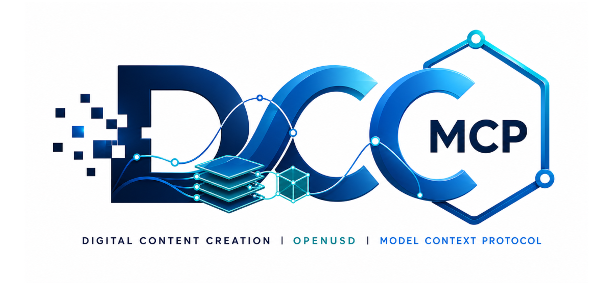

# dcc-mcp-openusd

<p align="center">
  
</p>

## Agent workflow

AI agents should use the shared gateway through `dcc-mcp-cli`; IDE users may
continue to use the MCP endpoint. Prefer typed skills and tools over raw scripts.

```bash
dcc-mcp-cli dcc-types
dcc-mcp-cli list
dcc-mcp-cli search --query "<task>" --dcc-type openusd
dcc-mcp-cli describe <tool-slug>
dcc-mcp-cli call <tool-slug> --json '{"key":"value"}'
```

`dcc-types` reports release-catalog support; `list` reports live sessions. If a
tool belongs to an inactive progressive skill, call `dcc-mcp-cli load-skill <skill-name> --dcc-type openusd` before retrying. For post-task improvement,
attach a stable session id with `--meta-json`, query `dcc-mcp-cli stats --range 24h --session-id <task-id>`, then pass the bounded evidence to the
`review_skill_improvement` prompt from `dcc-mcp-skills-creator`.


OpenUSD adapter and skills for the DCC Model Context Protocol ecosystem.

`dcc-mcp-openusd` runs a headless OpenUSD-oriented MCP server that can create
portable USD project folders, author simple stages, add references, validate
stages, and package USDZ-like archives. It is designed to plug into the
`dcc-mcp-core` gateway and skills-first workflow.

## Install

```bash
pip install dcc-mcp-openusd
```

This release train requires `dcc-mcp-core>=0.19.45`.

The base install operates in **text-fallback mode**: it reads and writes USDA
text without requiring the Pixar USD runtime. This mode is suitable for
lightweight agents, CI gates, and environments where native USD libraries
are unavailable.

The base install operates in **text-fallback mode**: it reads and writes USDA
text without requiring the Pixar USD runtime. This mode is suitable for
lightweight agents, CI gates, and environments where native USD libraries
are unavailable.

For full OpenUSD runtime behavior, install the optional Pixar USD bindings:

```bash
pip install "dcc-mcp-openusd[openusd]"
```

The `[openusd]` extra pulls in `usd-core>=24.11` (the Pixar open-source USD
Python bindings, importable as `pxr`). With pxr installed, all stage
authoring, material binding, camera/light definition, time-sampled animation,
and composition-arc operations go through the native USD runtime.

### Runtime mode detection

```python
from dcc_mcp_openusd.runtime import detect_runtime

runtime = detect_runtime()
print(runtime.has_pxr)   # True when pxr is installed
print(runtime.version)   # e.g. "24.11"
```

Every public function returns a `"runtime"` field in its result dict —
`"pxr"` when the native runtime was used, `"text-fallback"` otherwise.

### Feature boundary

| Feature | Text-fallback | pxr runtime |
| --- | --- | --- |
| `create_stage`, `create_project` | USDA text | Native `Usd.Stage` |
| `list_stage`, `define_xform`, `define_prim` | USDA parse + insert | Native API |
| `add_reference`, `set_xform_ops` | USDA text | Native API |
| `validate_stage`, `snapshot_stage`, `package_usdz` | USDA checks | Native validation |
| Material binding (`UsdShade`) | — | Requires pxr |
| Camera / Light (`UsdGeomCamera`, `UsdLux`) | — | Requires pxr |
| Time-sampled animation | — | Requires pxr |
| Sublayer / payload composition | — | Requires pxr |

Advanced features that cannot be expressed through text-fallback raise
`OpenUsdError("... requires the Pixar USD (pxr) package. Install it with: pip install usd-core")`
when pxr is absent.

## Run

```bash
dcc-mcp-openusd
```

The instance uses an OS-assigned direct port. Connect through the stable local
gateway, or discover the exact direct URL with `dcc-mcp-cli list`:

```text
http://127.0.0.1:9765/mcp
```

## Bundled Skills

The package ships seven bundled skills:

| Skill | Purpose |
| --- | --- |
| `openusd-project` | Create self-contained project folders and snapshots. |
| `openusd-stage` | Create stages, list prims, define xforms, set xform ops, modify stage metadata, and add references. |
| `openusd-validate` | Validate stage invariants and package a USDZ-style archive. |
| `openusd-material` | Create UsdShadeMaterial prims, attach UsdPreviewSurface shaders, and bind materials to geometry. |
| `openusd-light-camera` | Create cameras (UsdGeomCamera) and lights (DistantLight, SphereLight) with transforms. |
| `openusd-animation` | Set stage time codes and author translate/rotate/scale time samples. |
| `openusd-composition` | Add sublayers, payloads, variant sets, and variant selections for multi-layer scenes. |

Agents should follow the normal DCC-MCP flow:

1. `search_skills(query="openusd stage")`
2. `load_skill("openusd-stage")`
3. Call a typed tool such as `openusd_stage__create_stage`
4. Validate with `openusd_validate__validate_stage`

## Scope

This repository is intentionally an adapter/domain-skill package, not a new
core USD engine. `dcc-mcp-core` remains the shared transport, gateway,
validation, telemetry, and skill-loading foundation. This package owns
OpenUSD-specific project semantics, stage authoring tools, validation policy,
and packaging workflows.

## Development

```bash
# Minimal setup (text-fallback, fast CI gate)
pip install -e ".[dev]"
pytest tests/ --ignore=tests/e2e

# Full setup (pxr runtime, material/light/animation/composition tests)
pip install -e ".[dev,openusd]"
pytest tests/e2e/ -v
ruff check src tests tools
python -m build
```

The CI matrix enforces both modes:
- **`test-minimal`** — no pxr, runs unit tests + contract test (text-fallback baseline)
- **`test-openusd`** — with pxr, runs the e2e golden-path suite

## Release

The repository uses `release-please`. The baseline version is `0.0.0` so the
first release PR will cut `v0.1.0`. PyPI publishing is wired through the
`pypi` GitHub environment.
